# 智能集群状态缓存系统技术方案

## 1. 系统概述

### 1.1 项目背景
基于现有的K8s MCP Agent项目（使用Gemini 2.5 Flash + MCP工具调用架构），实现智能集群状态缓存系统，优化用户交互体验，通过缓存集群状态信息来提供智能的参数建议和工具调用优化。

### 1.2 核心设计原则
- **资源分层缓存策略**：区分K8s资源的变化频率
- **MCP工具预加载机制**：程序启动时扫描并缓存所有可用的K8s MCP工具
- **Fail Fast架构**：遵循现有的fail-fast原则，立即抛出异常而不是降级
- **环境变量配置**：遵循十二要素应用方法论

### 1.3 技术选型
- **缓存存储**：SQLite（零配置部署、SQL查询支持、文件型便于备份）
- **LLM集成**：Gemini 2.5 Flash（1M+ 输入上下文、32K输出、600s超时）
- **异步调度**：Python asyncio（后台定时扫描）
- **配置管理**：环境变量 + .env文件

## 2. 系统架构

### 2.1 整体架构图


### 2.2 分层缓存策略

#### 2.2.1 静态资源层（TTL: 30分钟）
- **集群信息**：cluster metadata, version, nodes
- **命名空间**：namespaces, resource quotas
- **节点信息**：node specs, labels, taints
- **存储类**：storage classes, persistent volumes

#### 2.2.2 动态资源层（TTL: 5分钟）
- **工作负载**：pods, deployments, replicasets
- **服务发现**：services, endpoints, ingress
- **配置管理**：configmaps, secrets
- **监控数据**：metrics, events

## 3. 数据库设计

### 3.1 SQLite Schema设计

```sql
-- 集群基础信息表
CREATE TABLE clusters (
    id INTEGER PRIMARY KEY AUTOINCREMENT,
    name TEXT UNIQUE NOT NULL,
    version TEXT NOT NULL,
    api_server TEXT NOT NULL,
    node_count INTEGER NOT NULL,
    created_at TIMESTAMP DEFAULT CURRENT_TIMESTAMP,
    updated_at TIMESTAMP DEFAULT CURRENT_TIMESTAMP,
    ttl_expires_at TIMESTAMP NOT NULL
);

-- 命名空间表
CREATE TABLE namespaces (
    id INTEGER PRIMARY KEY AUTOINCREMENT,
    cluster_name TEXT NOT NULL,
    name TEXT NOT NULL,
    status TEXT NOT NULL,
    labels TEXT, -- JSON格式
    annotations TEXT, -- JSON格式
    created_at TIMESTAMP DEFAULT CURRENT_TIMESTAMP,
    updated_at TIMESTAMP DEFAULT CURRENT_TIMESTAMP,
    ttl_expires_at TIMESTAMP NOT NULL,
    UNIQUE(cluster_name, name)
);

-- 节点表
CREATE TABLE nodes (
    id INTEGER PRIMARY KEY AUTOINCREMENT,
    cluster_name TEXT NOT NULL,
    name TEXT NOT NULL,
    status TEXT NOT NULL,
    roles TEXT, -- JSON数组
    capacity TEXT, -- JSON格式
    allocatable TEXT, -- JSON格式
    labels TEXT, -- JSON格式
    taints TEXT, -- JSON格式
    created_at TIMESTAMP DEFAULT CURRENT_TIMESTAMP,
    updated_at TIMESTAMP DEFAULT CURRENT_TIMESTAMP,
    ttl_expires_at TIMESTAMP NOT NULL,
    UNIQUE(cluster_name, name)
);

-- Pod表（动态资源）
CREATE TABLE pods (
    id INTEGER PRIMARY KEY AUTOINCREMENT,
    cluster_name TEXT NOT NULL,
    namespace TEXT NOT NULL,
    name TEXT NOT NULL,
    status TEXT NOT NULL,
    phase TEXT NOT NULL,
    node_name TEXT,
    labels TEXT, -- JSON格式
    containers TEXT, -- JSON格式
    created_at TIMESTAMP DEFAULT CURRENT_TIMESTAMP,
    updated_at TIMESTAMP DEFAULT CURRENT_TIMESTAMP,
    ttl_expires_at TIMESTAMP NOT NULL,
    UNIQUE(cluster_name, namespace, name)
);

-- 服务表（动态资源）
CREATE TABLE services (
    id INTEGER PRIMARY KEY AUTOINCREMENT,
    cluster_name TEXT NOT NULL,
    namespace TEXT NOT NULL,
    name TEXT NOT NULL,
    type TEXT NOT NULL,
    cluster_ip TEXT,
    external_ip TEXT,
    ports TEXT, -- JSON格式
    selector TEXT, -- JSON格式
    created_at TIMESTAMP DEFAULT CURRENT_TIMESTAMP,
    updated_at TIMESTAMP DEFAULT CURRENT_TIMESTAMP,
    ttl_expires_at TIMESTAMP NOT NULL,
    UNIQUE(cluster_name, namespace, name)
);

-- MCP工具映射表
CREATE TABLE mcp_tools (
    id INTEGER PRIMARY KEY AUTOINCREMENT,
    name TEXT UNIQUE NOT NULL,
    description TEXT,
    input_schema TEXT, -- JSON格式
    output_schema TEXT, -- JSON格式
    resource_types TEXT, -- JSON数组，支持的K8s资源类型
    operation_types TEXT, -- JSON数组，支持的操作类型
    required_params TEXT, -- JSON数组
    optional_params TEXT, -- JSON数组
    created_at TIMESTAMP DEFAULT CURRENT_TIMESTAMP,
    updated_at TIMESTAMP DEFAULT CURRENT_TIMESTAMP
);

-- 工具使用统计表
CREATE TABLE tool_usage_stats (
    id INTEGER PRIMARY KEY AUTOINCREMENT,
    tool_name TEXT NOT NULL,
    usage_count INTEGER DEFAULT 0,
    success_count INTEGER DEFAULT 0,
    error_count INTEGER DEFAULT 0,
    avg_response_time REAL DEFAULT 0.0,
    last_used_at TIMESTAMP,
    created_at TIMESTAMP DEFAULT CURRENT_TIMESTAMP,
    updated_at TIMESTAMP DEFAULT CURRENT_TIMESTAMP
);

-- 缓存元数据表
CREATE TABLE cache_metadata (
    id INTEGER PRIMARY KEY AUTOINCREMENT,
    table_name TEXT NOT NULL,
    cluster_name TEXT NOT NULL,
    last_scan_at TIMESTAMP,
    next_scan_at TIMESTAMP,
    scan_status TEXT DEFAULT 'pending', -- pending, running, completed, failed
    error_message TEXT,
    record_count INTEGER DEFAULT 0,
    created_at TIMESTAMP DEFAULT CURRENT_TIMESTAMP,
    updated_at TIMESTAMP DEFAULT CURRENT_TIMESTAMP,
    UNIQUE(table_name, cluster_name)
);
```

## 4. 环境变量配置规范

### 4.1 缓存系统配置
```bash
# 缓存数据库配置
CACHE_DB_PATH=./data/k8s_cache.db
CACHE_DB_TIMEOUT=30
CACHE_DB_MAX_CONNECTIONS=10

# 缓存TTL配置（秒）
CACHE_STATIC_TTL=1800    # 30分钟
CACHE_DYNAMIC_TTL=300    # 5分钟
CACHE_TOOL_MAPPING_TTL=3600  # 1小时

# 扫描调度配置
SCANNER_STATIC_INTERVAL=1800   # 30分钟
SCANNER_DYNAMIC_INTERVAL=300   # 5分钟
SCANNER_MAX_CONCURRENT=3
SCANNER_TIMEOUT=120

# 智能增强配置
CONTEXT_MAX_TOKENS=100000      # 上下文最大token数
CONTEXT_COMPRESSION_RATIO=0.7  # 压缩比例
INTENT_ANALYSIS_TIMEOUT=10     # 意图分析超时
```

### 4.2 现有配置继承
```bash
# 继承现有LLM配置
LLM_MODEL_NAME=google/gemini-2.0-flash-exp
LLM_MAX_INPUT_CONTEXT=1048576
LLM_MAX_OUTPUT_TOKENS=32768
LLM_REQUEST_TIMEOUT=600

# 继承现有MCP配置
MCP_SERVER_URL=stdio:///path/to/k8s-mcp
MCP_SERVER_TYPE=stdio
MCP_SERVER_NAME=k8s-mcp
```

## 5. MCP工具预加载机制

### 5.1 工具发现流程

```mermaid
sequenceDiagram
    participant APP as 应用启动
    participant LOADER as 工具加载器
    participant MCP as MCP客户端
    participant DB as SQLite数据库
    participant TOOLS as K8s工具集

    APP->>LOADER: 启动工具预加载
    LOADER->>MCP: 连接MCP服务器
    MCP->>TOOLS: 获取可用工具列表
    TOOLS-->>MCP: 返回工具清单
    MCP-->>LOADER: 工具元数据

    loop 每个工具
        LOADER->>MCP: 获取工具schema
        MCP-->>LOADER: 输入/输出schema
        LOADER->>LOADER: 分析工具能力
        LOADER->>DB: 存储工具映射
    end

    LOADER->>APP: 预加载完成
```



### 5.2 工具能力映射

```python
# 工具能力分类示例
TOOL_CAPABILITIES = {
    "list_pods": {
        "resource_types": ["pod"],
        "operation_types": ["list", "read"],
        "scope": "namespace",
        "required_params": ["namespace"],
        "optional_params": ["label_selector", "field_selector"],
        "output_format": "list",
        "cache_friendly": True
    },
    "get_cluster_info": {
        "resource_types": ["cluster"],
        "operation_types": ["read"],
        "scope": "cluster",
        "required_params": [],
        "optional_params": [],
        "output_format": "object",
        "cache_friendly": True
    },
    "delete_pod": {
        "resource_types": ["pod"],
        "operation_types": ["delete"],
        "scope": "namespace",
        "required_params": ["namespace", "name"],
        "optional_params": ["grace_period"],
        "output_format": "status",
        "cache_friendly": False
    }
}
```

## 6. 智能上下文增强算法

### 6.1 用户意图分析


### 6.2 参数智能建议算法

```python
class ParameterSuggester:
    def suggest_parameters(self, user_intent: str, tool_name: str) -> Dict[str, Any]:
        """基于缓存数据和用户意图智能建议参数"""
        suggestions = {}

        # 1. 从缓存获取相关资源
        cached_resources = self.get_cached_resources(user_intent)

        # 2. 分析工具参数要求
        tool_schema = self.get_tool_schema(tool_name)

        # 3. 智能匹配和建议
        for param in tool_schema.required_params:
            if param == "namespace":
                suggestions[param] = self.suggest_namespace(cached_resources)
            elif param == "name":
                suggestions[param] = self.suggest_resource_name(cached_resources)
            elif param == "label_selector":
                suggestions[param] = self.suggest_labels(cached_resources)

        return suggestions
```

## 7. MVP实现路线图

### 7.1 迭代计划

| 迭代 | 功能模块 | 预计工期 | 验收标准 |
|------|----------|----------|----------|
| 1 | SQLite数据库设计和基础缓存类 | 1天 | 数据库创建、基础CRUD操作 |
| 2 | MCP工具预加载机制 | 1天 | 工具发现、能力映射、存储 |
| 3 | 单集群基础信息扫描 | 1天 | 静态/动态资源扫描、存储 |
| 4 | 后台定时扫描服务 | 1天 | 异步调度、差异化频率 |
| 5 | 智能上下文增强器 | 1天 | 意图分析、参数建议 |
| 6 | Gemini 2.5 Flash集成 | 1天 | 上下文注入、降级机制 |

### 7.2 技术风险评估

| 风险项 | 影响程度 | 概率 | 缓解措施 |
|--------|----------|------|----------|
| MCP工具兼容性 | 高 | 中 | 预先测试、fallback机制 |
| SQLite性能瓶颈 | 中 | 低 | 索引优化、分表策略 |
| 上下文token限制 | 中 | 中 | 压缩算法、分批处理 |
| 缓存一致性 | 高 | 中 | TTL机制、强制刷新 |

## 8. 性能指标和监控方案

### 8.1 关键性能指标（KPI）

```python
PERFORMANCE_METRICS = {
    "cache_hit_rate": {
        "target": "> 80%",
        "measurement": "缓存命中次数 / 总查询次数"
    },
    "response_time_improvement": {
        "target": "> 50%",
        "measurement": "缓存响应时间 vs MCP直接调用"
    },
    "scan_completion_rate": {
        "target": "> 95%",
        "measurement": "成功扫描次数 / 计划扫描次数"
    },
    "context_accuracy": {
        "target": "> 90%",
        "measurement": "正确参数建议 / 总建议次数"
    }
}
```

### 8.2 监控和日志

```python
# 监控配置
MONITORING_CONFIG = {
    "log_level": "INFO",
    "metrics_collection": True,
    "performance_tracking": True,
    "error_alerting": True,
    "cache_statistics": True
}

# 日志格式
LOG_FORMAT = {
    "timestamp": "ISO8601",
    "level": "INFO|WARN|ERROR",
    "component": "cache|scanner|enhancer",
    "operation": "scan|query|suggest",
    "duration_ms": "number",
    "cache_hit": "boolean",
    "error_details": "string"
}
```

## 9. 部署和运维

### 9.1 部署要求
- Python 3.11+
- SQLite 3.35+
- 磁盘空间：至少1GB（缓存数据）
- 内存：至少512MB（运行时缓存）
- 网络：稳定的MCP服务器连接

### 9.2 运维检查清单
- [ ] 缓存数据库文件权限正确
- [ ] 环境变量配置完整
- [ ] MCP服务器连接正常
- [ ] 后台扫描服务运行
- [ ] 日志文件轮转配置
- [ ] 性能指标监控启用

## 10. 安全考虑

### 10.1 数据安全
- SQLite数据库文件加密（可选）
- 敏感信息（如secrets）不缓存
- 访问日志记录和审计

### 10.2 权限控制
- 继承现有K8s RBAC权限
- 缓存数据访问控制
- MCP工具调用权限验证
