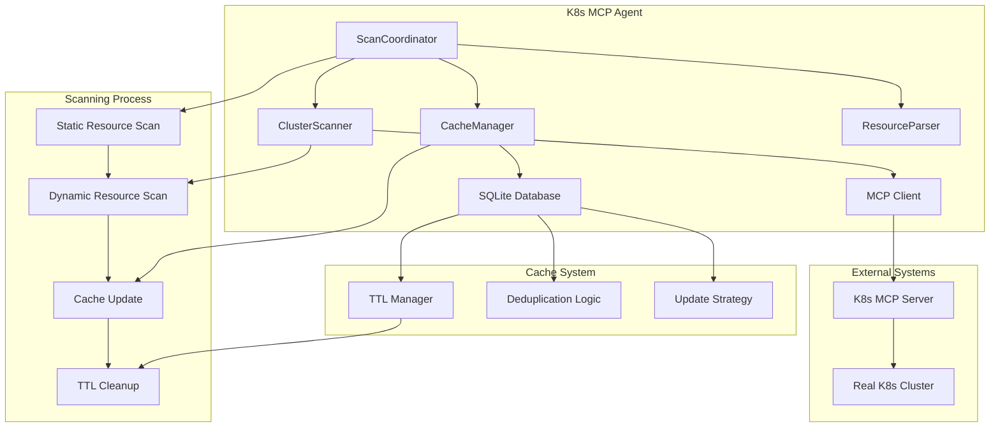
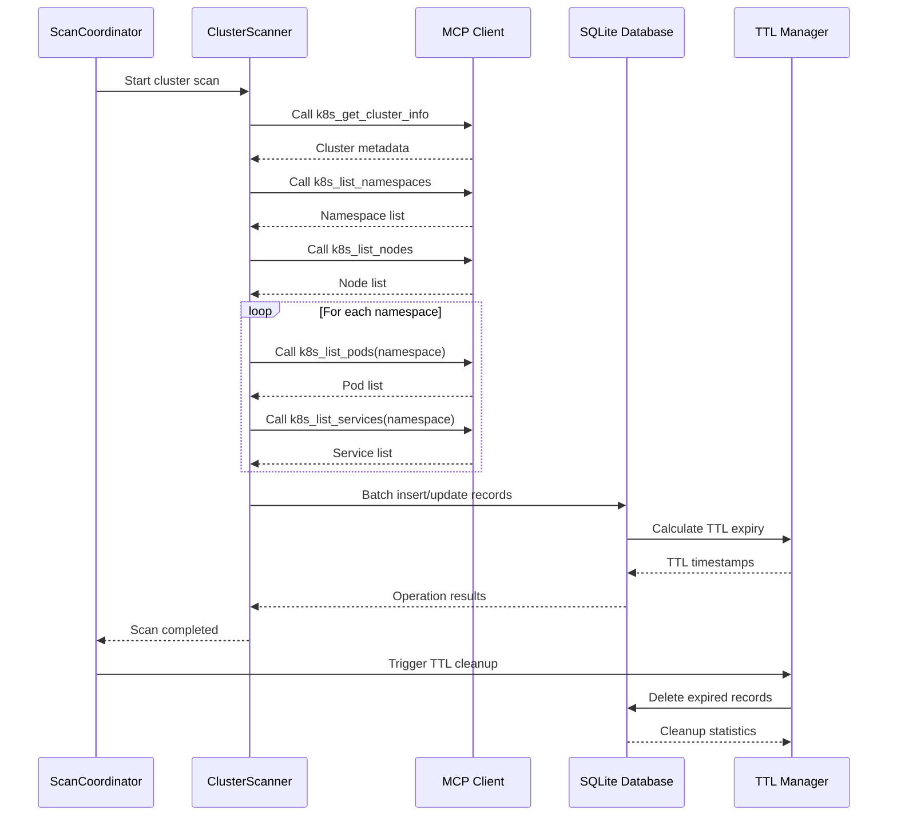
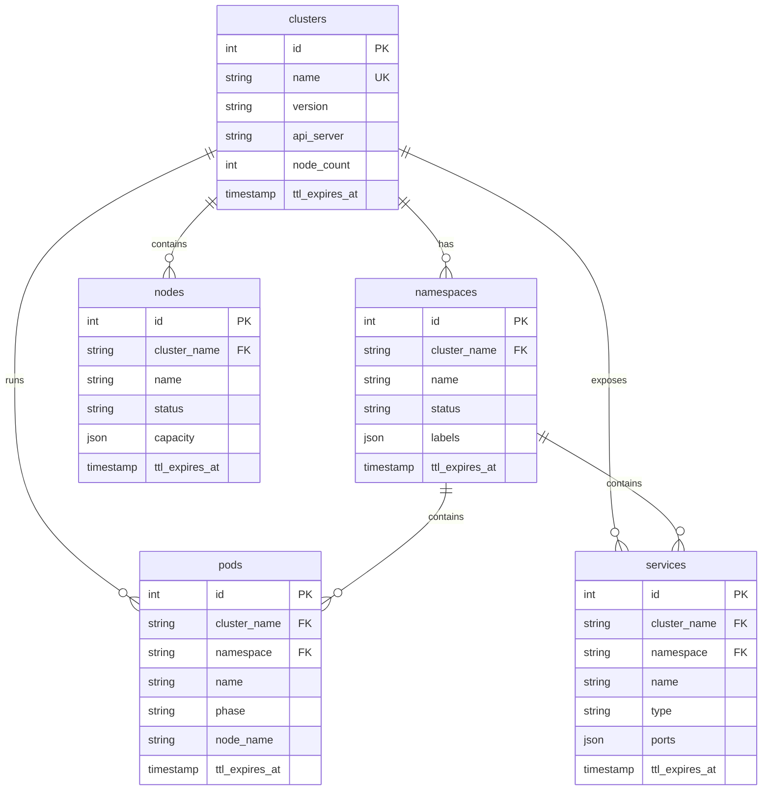
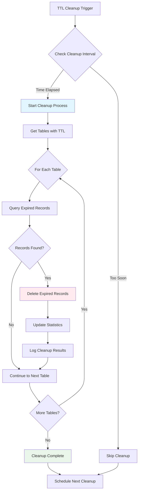

# Cluster State Caching System - Technical Documentation

## 1. System Overview

The Cluster State Caching System provides intelligent caching of Kubernetes cluster state information through MCP (Model Context Protocol) tools. The system follows fail-fast principles with strict error handling and focuses on core functionality without performance optimizations or security features.

### 1.1 Core Components

```
┌─────────────────┐    ┌─────────────────┐    ┌─────────────────┐
│  ScanCoordinator │────│ ClusterScanner  │────│   MCP Client    │
└─────────────────┘    └─────────────────┘    └─────────────────┘
         │                       │                       │
         │                       │                       │
         ▼                       ▼                       ▼
┌─────────────────┐    ┌─────────────────┐    ┌─────────────────┐
│  CacheManager   │────│ SQLite Database │    │ K8s MCP Server  │
└─────────────────┘    └─────────────────┘    └─────────────────┘
         │                       │                       │
         │                       │                       │
         ▼                       ▼                       ▼
┌─────────────────┐    ┌─────────────────┐    ┌─────────────────┐
│ ResourceParser  │    │   TTL Manager   │    │ Real K8s Cluster│
└─────────────────┘    └─────────────────┘    └─────────────────┘
```

### 1.2 Design Principles

- **Fail-Fast**: Immediate exception throwing without error masking
- **Core Logic Only**: Essential functionality without optimizations
- **Data Authenticity**: All data must come from real MCP tool calls
- **Simplicity**: Direct implementation patterns over complex abstractions

## 2. Deduplication Strategy

### 2.1 Primary Key Approach

Each cluster record is stored only once using cluster name as the primary key:

```sql
-- Cluster deduplication using UNIQUE constraint
CREATE TABLE clusters (
    id INTEGER PRIMARY KEY AUTOINCREMENT,
    name TEXT UNIQUE NOT NULL,  -- Primary deduplication key
    version TEXT NOT NULL,
    api_server TEXT NOT NULL,
    node_count INTEGER NOT NULL,
    created_at TIMESTAMP DEFAULT CURRENT_TIMESTAMP,
    updated_at TIMESTAMP DEFAULT CURRENT_TIMESTAMP,
    ttl_expires_at TIMESTAMP NOT NULL
);
```

### 2.2 Conflict Resolution

When duplicate cluster names are detected:

```python
def handle_cluster_deduplication(cluster_name: str, new_data: dict) -> int:
    """Handle cluster record deduplication with fail-fast approach"""
    try:
        # Attempt INSERT with UNIQUE constraint
        cursor.execute("""
            INSERT INTO clusters (name, version, api_server, node_count, ttl_expires_at)
            VALUES (?, ?, ?, ?, ?)
        """, (cluster_name, new_data['version'], new_data['api_server'], 
              new_data['node_count'], calculate_ttl_expiry('static')))
        
        return cursor.lastrowid
        
    except sqlite3.IntegrityError as e:
        if "UNIQUE constraint failed" in str(e):
            # Update existing record instead of creating duplicate
            return update_existing_cluster(cluster_name, new_data)
        else:
            # Fail fast on unexpected integrity errors
            raise ClusterDeduplicationError(
                f"Cluster deduplication failed for {cluster_name}: {e}"
            ) from e
```

### 2.3 Composite Key Deduplication

For namespaced resources, use composite UNIQUE constraints:

```sql
-- Pod deduplication using composite key
CREATE TABLE pods (
    id INTEGER PRIMARY KEY AUTOINCREMENT,
    cluster_name TEXT NOT NULL,
    namespace TEXT NOT NULL,
    name TEXT NOT NULL,
    -- ... other fields
    UNIQUE(cluster_name, namespace, name)  -- Composite deduplication key
);
```

## 3. TTL Implementation

### 3.1 Timestamp-Based Expiration

SQLite doesn't have native TTL, so we implement it using timestamps:

```python
from datetime import datetime, timedelta

class TTLManager:
    """TTL management with timestamp-based expiration"""
    
    def __init__(self, static_ttl: int = 1800, dynamic_ttl: int = 300):
        self.static_ttl = static_ttl  # 30 minutes
        self.dynamic_ttl = dynamic_ttl  # 5 minutes
    
    def calculate_expiry(self, resource_type: str) -> datetime:
        """Calculate TTL expiry timestamp"""
        now = datetime.utcnow()
        
        if resource_type in ['clusters', 'namespaces', 'nodes']:
            return now + timedelta(seconds=self.static_ttl)
        else:
            return now + timedelta(seconds=self.dynamic_ttl)
    
    def is_expired(self, expiry_time: datetime) -> bool:
        """Check if record is expired"""
        return datetime.utcnow() > expiry_time
```

### 3.2 Background Cleanup Process

Automated cleanup of expired records:

```python
def cleanup_expired_records() -> dict:
    """Clean up expired records with fail-fast error handling"""
    cleanup_stats = {}
    
    tables_with_ttl = ['clusters', 'namespaces', 'nodes', 'pods', 'services']
    
    for table in tables_with_ttl:
        try:
            cursor.execute(f"""
                DELETE FROM {table} 
                WHERE ttl_expires_at < ?
            """, (datetime.utcnow(),))
            
            deleted_count = cursor.rowcount
            cleanup_stats[table] = deleted_count
            
            if deleted_count > 0:
                print(f"Cleaned up {deleted_count} expired records from {table}")
                
        except Exception as e:
            # Fail fast on cleanup errors
            raise TTLCleanupError(
                f"Failed to cleanup expired records from {table}: {e}"
            ) from e
    
    return cleanup_stats
```

### 3.3 TTL Query Integration

All queries automatically filter expired records:

```python
def get_valid_records(table: str, **filters) -> list:
    """Get non-expired records with automatic TTL filtering"""
    where_conditions = ["ttl_expires_at > ?"]
    params = [datetime.utcnow()]
    
    for key, value in filters.items():
        where_conditions.append(f"{key} = ?")
        params.append(value)
    
    query = f"""
        SELECT * FROM {table} 
        WHERE {' AND '.join(where_conditions)}
    """
    
    try:
        cursor.execute(query, params)
        return cursor.fetchall()
    except Exception as e:
        raise RecordQueryError(
            f"Failed to query valid records from {table}: {e}"
        ) from e
```

## 4. Scanning Logic

### 4.1 MCP Tool Mapping

Predefined tool mappings for systematic scanning:

```python
class ClusterScanner:
    """Cluster scanning with predefined MCP tool mappings"""
    
    # Static resources (TTL: 30 minutes)
    STATIC_RESOURCE_TOOLS = {
        'cluster': 'k8s_get_cluster_info',
        'namespaces': 'k8s_list_namespaces', 
        'nodes': 'k8s_list_nodes'
    }
    
    # Dynamic resources (TTL: 5 minutes)
    DYNAMIC_RESOURCE_TOOLS = {
        'pods': 'k8s_list_pods',
        'services': 'k8s_list_services',
        'deployments': 'k8s_list_deployments',
        'configmaps': 'k8s_list_configmaps',
        'secrets': 'k8s_list_secrets'
    }
```

### 4.2 Scanning Workflow

Complete scanning process with error handling:

```python
async def scan_cluster_resources(cluster_name: str) -> dict:
    """Scan all cluster resources with fail-fast error handling"""
    scan_results = {
        'static_resources': {},
        'dynamic_resources': {},
        'errors': []
    }
    
    try:
        # 1. Scan static resources first
        for resource_type, tool_name in STATIC_RESOURCE_TOOLS.items():
            try:
                result = await call_mcp_tool(tool_name, {})
                scan_results['static_resources'][resource_type] = result
                
            except Exception as e:
                error_msg = f"Failed to scan {resource_type} using {tool_name}: {e}"
                scan_results['errors'].append(error_msg)
                # Fail fast on critical static resource errors
                if resource_type == 'cluster':
                    raise ClusterScanError(error_msg) from e
        
        # 2. Scan dynamic resources by namespace
        namespaces = scan_results['static_resources'].get('namespaces', {}).get('items', [])
        
        for namespace_data in namespaces:
            namespace = namespace_data.get('metadata', {}).get('name', 'default')
            
            for resource_type, tool_name in DYNAMIC_RESOURCE_TOOLS.items():
                try:
                    params = {'namespace': namespace} if namespace != 'cluster-wide' else {}
                    result = await call_mcp_tool(tool_name, params)
                    
                    if resource_type not in scan_results['dynamic_resources']:
                        scan_results['dynamic_resources'][resource_type] = []
                    
                    scan_results['dynamic_resources'][resource_type].extend(
                        result.get('items', [])
                    )
                    
                except Exception as e:
                    error_msg = f"Failed to scan {resource_type} in {namespace}: {e}"
                    scan_results['errors'].append(error_msg)
                    # Continue scanning other resources, don't fail fast here
        
        return scan_results

    except Exception as e:
        # Fail fast on unexpected scanning errors
        raise ClusterScanError(f"Cluster scanning failed: {e}") from e
```

### 4.3 Scanning Schedule and Triggers

Scanning frequency and trigger mechanisms:

```python
class ScanScheduler:
    """Scanning schedule management with fail-fast approach"""

    def __init__(self):
        self.static_interval = 1800  # 30 minutes
        self.dynamic_interval = 300  # 5 minutes
        self.max_concurrent_scans = 3
        self.scan_timeout = 120  # 2 minutes

    async def schedule_periodic_scans(self):
        """Schedule periodic scans with strict error handling"""
        try:
            # Schedule static resource scans
            asyncio.create_task(self._periodic_static_scan())

            # Schedule dynamic resource scans
            asyncio.create_task(self._periodic_dynamic_scan())

        except Exception as e:
            raise ScanScheduleError(f"Failed to schedule periodic scans: {e}") from e

    async def _periodic_static_scan(self):
        """Periodic static resource scanning"""
        while True:
            try:
                await self.scan_static_resources()
                await asyncio.sleep(self.static_interval)

            except Exception as e:
                # Fail fast on scan scheduling errors
                raise StaticScanError(f"Static scan scheduling failed: {e}") from e
```

### 4.4 Error Handling and Retry Logic

Strict error handling with limited retries:

```python
async def call_mcp_tool_with_retry(tool_name: str, params: dict, max_retries: int = 2) -> dict:
    """Call MCP tool with limited retry and fail-fast approach"""
    last_error = None

    for attempt in range(max_retries + 1):
        try:
            result = await asyncio.wait_for(
                mcp_client.run(f"Use {tool_name} tool with params {params}", max_steps=1),
                timeout=60
            )
            return result

        except asyncio.TimeoutError as e:
            last_error = e
            if attempt == max_retries:
                raise ToolTimeoutError(
                    f"Tool {tool_name} timed out after {max_retries + 1} attempts"
                ) from e

        except Exception as e:
            last_error = e
            if attempt == max_retries:
                raise ToolCallError(
                    f"Tool {tool_name} failed after {max_retries + 1} attempts: {e}"
                ) from e

        # Brief delay before retry
        await asyncio.sleep(1)

    # Should never reach here, but fail fast if it does
    raise ToolCallError(f"Unexpected error in tool retry logic: {last_error}")
```

## 5. Database Schema

### 5.1 Complete Table Definitions

Exact database schema with all constraints and indexes:

```sql
-- Cluster information table (Static Resource)
CREATE TABLE clusters (
    id INTEGER PRIMARY KEY AUTOINCREMENT,
    name TEXT UNIQUE NOT NULL,
    version TEXT NOT NULL,
    api_server TEXT NOT NULL,
    node_count INTEGER NOT NULL,
    status TEXT DEFAULT 'unknown',
    created_at TIMESTAMP DEFAULT CURRENT_TIMESTAMP,
    updated_at TIMESTAMP DEFAULT CURRENT_TIMESTAMP,
    ttl_expires_at TIMESTAMP NOT NULL
);

-- Performance indexes for clusters
CREATE INDEX idx_clusters_name ON clusters(name);
CREATE INDEX idx_clusters_ttl ON clusters(ttl_expires_at);
CREATE INDEX idx_clusters_status ON clusters(status);

-- Namespace table (Static Resource)
CREATE TABLE namespaces (
    id INTEGER PRIMARY KEY AUTOINCREMENT,
    cluster_name TEXT NOT NULL,
    name TEXT NOT NULL,
    status TEXT NOT NULL,
    labels TEXT, -- JSON format
    annotations TEXT, -- JSON format
    resource_quota TEXT, -- JSON format
    created_at TIMESTAMP DEFAULT CURRENT_TIMESTAMP,
    updated_at TIMESTAMP DEFAULT CURRENT_TIMESTAMP,
    ttl_expires_at TIMESTAMP NOT NULL,
    UNIQUE(cluster_name, name),
    FOREIGN KEY(cluster_name) REFERENCES clusters(name) ON DELETE CASCADE
);

-- Performance indexes for namespaces
CREATE INDEX idx_namespaces_cluster ON namespaces(cluster_name);
CREATE INDEX idx_namespaces_ttl ON namespaces(ttl_expires_at);
CREATE INDEX idx_namespaces_status ON namespaces(status);

-- Node table (Static Resource)
CREATE TABLE nodes (
    id INTEGER PRIMARY KEY AUTOINCREMENT,
    cluster_name TEXT NOT NULL,
    name TEXT NOT NULL,
    status TEXT NOT NULL,
    roles TEXT, -- JSON array
    capacity TEXT, -- JSON format
    allocatable TEXT, -- JSON format
    labels TEXT, -- JSON format
    taints TEXT, -- JSON format
    node_info TEXT, -- JSON format (OS, kernel, etc.)
    created_at TIMESTAMP DEFAULT CURRENT_TIMESTAMP,
    updated_at TIMESTAMP DEFAULT CURRENT_TIMESTAMP,
    ttl_expires_at TIMESTAMP NOT NULL,
    UNIQUE(cluster_name, name),
    FOREIGN KEY(cluster_name) REFERENCES clusters(name) ON DELETE CASCADE
);

-- Performance indexes for nodes
CREATE INDEX idx_nodes_cluster ON nodes(cluster_name);
CREATE INDEX idx_nodes_ttl ON nodes(ttl_expires_at);
CREATE INDEX idx_nodes_status ON nodes(status);

-- Pod table (Dynamic Resource)
CREATE TABLE pods (
    id INTEGER PRIMARY KEY AUTOINCREMENT,
    cluster_name TEXT NOT NULL,
    namespace TEXT NOT NULL,
    name TEXT NOT NULL,
    status TEXT NOT NULL,
    phase TEXT NOT NULL,
    node_name TEXT,
    pod_ip TEXT,
    host_ip TEXT,
    labels TEXT, -- JSON format
    annotations TEXT, -- JSON format
    containers TEXT, -- JSON format
    conditions TEXT, -- JSON format
    restart_count INTEGER DEFAULT 0,
    created_at TIMESTAMP DEFAULT CURRENT_TIMESTAMP,
    updated_at TIMESTAMP DEFAULT CURRENT_TIMESTAMP,
    ttl_expires_at TIMESTAMP NOT NULL,
    UNIQUE(cluster_name, namespace, name),
    FOREIGN KEY(cluster_name) REFERENCES clusters(name) ON DELETE CASCADE,
    FOREIGN KEY(cluster_name, namespace) REFERENCES namespaces(cluster_name, name) ON DELETE CASCADE
);

-- Performance indexes for pods
CREATE INDEX idx_pods_cluster_namespace ON pods(cluster_name, namespace);
CREATE INDEX idx_pods_ttl ON pods(ttl_expires_at);
CREATE INDEX idx_pods_status ON pods(status);
CREATE INDEX idx_pods_phase ON pods(phase);
CREATE INDEX idx_pods_node ON pods(node_name);

-- Service table (Dynamic Resource)
CREATE TABLE services (
    id INTEGER PRIMARY KEY AUTOINCREMENT,
    cluster_name TEXT NOT NULL,
    namespace TEXT NOT NULL,
    name TEXT NOT NULL,
    type TEXT NOT NULL,
    cluster_ip TEXT,
    external_ip TEXT,
    ports TEXT, -- JSON format
    selector TEXT, -- JSON format
    labels TEXT, -- JSON format
    annotations TEXT, -- JSON format
    created_at TIMESTAMP DEFAULT CURRENT_TIMESTAMP,
    updated_at TIMESTAMP DEFAULT CURRENT_TIMESTAMP,
    ttl_expires_at TIMESTAMP NOT NULL,
    UNIQUE(cluster_name, namespace, name),
    FOREIGN KEY(cluster_name) REFERENCES clusters(name) ON DELETE CASCADE,
    FOREIGN KEY(cluster_name, namespace) REFERENCES namespaces(cluster_name, name) ON DELETE CASCADE
);

-- Performance indexes for services
CREATE INDEX idx_services_cluster_namespace ON services(cluster_name, namespace);
CREATE INDEX idx_services_ttl ON services(ttl_expires_at);
CREATE INDEX idx_services_type ON services(type);

-- MCP Tools table (Tool Mapping)
CREATE TABLE mcp_tools (
    id INTEGER PRIMARY KEY AUTOINCREMENT,
    name TEXT UNIQUE NOT NULL,
    description TEXT,
    input_schema TEXT, -- JSON format
    output_schema TEXT, -- JSON format
    resource_types TEXT, -- JSON array
    operation_types TEXT, -- JSON array
    required_params TEXT, -- JSON array
    optional_params TEXT, -- JSON array
    capabilities TEXT, -- JSON format
    created_at TIMESTAMP DEFAULT CURRENT_TIMESTAMP,
    updated_at TIMESTAMP DEFAULT CURRENT_TIMESTAMP,
    ttl_expires_at TIMESTAMP NOT NULL
);

-- Performance indexes for mcp_tools
CREATE INDEX idx_mcp_tools_name ON mcp_tools(name);
CREATE INDEX idx_mcp_tools_ttl ON mcp_tools(ttl_expires_at);

-- Cache metadata table (System Management)
CREATE TABLE cache_metadata (
    id INTEGER PRIMARY KEY AUTOINCREMENT,
    table_name TEXT NOT NULL,
    cluster_name TEXT NOT NULL,
    last_scan_at TIMESTAMP,
    next_scan_at TIMESTAMP,
    scan_status TEXT DEFAULT 'pending', -- pending, running, completed, failed
    error_message TEXT,
    record_count INTEGER DEFAULT 0,
    scan_duration_ms INTEGER DEFAULT 0,
    created_at TIMESTAMP DEFAULT CURRENT_TIMESTAMP,
    updated_at TIMESTAMP DEFAULT CURRENT_TIMESTAMP,
    UNIQUE(table_name, cluster_name)
);

-- Performance indexes for cache_metadata
CREATE INDEX idx_cache_metadata_table_cluster ON cache_metadata(table_name, cluster_name);
CREATE INDEX idx_cache_metadata_status ON cache_metadata(scan_status);
CREATE INDEX idx_cache_metadata_next_scan ON cache_metadata(next_scan_at);
```

### 5.2 Foreign Key Relationships

Database relationships with cascading deletes:

```sql
-- Enable foreign key constraints
PRAGMA foreign_keys = ON;

-- Relationship hierarchy:
-- clusters (root)
--   ├── namespaces (cluster_name → clusters.name)
--   ├── nodes (cluster_name → clusters.name)
--   └── pods (cluster_name → clusters.name, namespace → namespaces.name)
--   └── services (cluster_name → clusters.name, namespace → namespaces.name)
```

### 5.3 Data Integrity Constraints

Constraints ensuring data consistency:

```sql
-- Cluster name validation
ALTER TABLE clusters ADD CONSTRAINT chk_cluster_name
CHECK (length(name) > 0 AND name NOT LIKE '% %');

-- Namespace status validation
ALTER TABLE namespaces ADD CONSTRAINT chk_namespace_status
CHECK (status IN ('Active', 'Terminating', 'Unknown'));

-- Pod phase validation
ALTER TABLE pods ADD CONSTRAINT chk_pod_phase
CHECK (phase IN ('Pending', 'Running', 'Succeeded', 'Failed', 'Unknown'));

-- Service type validation
ALTER TABLE services ADD CONSTRAINT chk_service_type
CHECK (type IN ('ClusterIP', 'NodePort', 'LoadBalancer', 'ExternalName'));

-- TTL expiry validation (must be in future)
ALTER TABLE clusters ADD CONSTRAINT chk_cluster_ttl
CHECK (ttl_expires_at > created_at);
```

## 6. Data Content Specification

### 6.1 Cluster Metadata Content

Exact information captured for cluster resources:

```python
class ClusterDataSpec:
    """Specification for cluster data content"""

    CLUSTER_FIELDS = {
        'name': 'string',           # Cluster identifier (primary key)
        'version': 'string',        # Kubernetes version (e.g., "v1.28.0")
        'api_server': 'string',     # API server URL
        'node_count': 'integer',    # Total number of nodes
        'status': 'string',         # Cluster status (Ready, NotReady, Unknown)
    }

    NAMESPACE_FIELDS = {
        'cluster_name': 'string',   # Foreign key to clusters
        'name': 'string',           # Namespace name
        'status': 'string',         # Active, Terminating, Unknown
        'labels': 'json',           # Key-value labels
        'annotations': 'json',      # Key-value annotations
        'resource_quota': 'json',   # Resource quota specifications
    }

    NODE_FIELDS = {
        'cluster_name': 'string',   # Foreign key to clusters
        'name': 'string',           # Node name
        'status': 'string',         # Ready, NotReady, Unknown
        'roles': 'json_array',      # Node roles (master, worker)
        'capacity': 'json',         # Resource capacity (CPU, memory, storage)
        'allocatable': 'json',      # Allocatable resources
        'labels': 'json',           # Node labels
        'taints': 'json',           # Node taints
        'node_info': 'json',        # OS, kernel, container runtime info
    }
```

### 6.2 Dynamic Resource Content

Content specification for dynamic resources:

```python
    POD_FIELDS = {
        'cluster_name': 'string',   # Foreign key to clusters
        'namespace': 'string',      # Foreign key to namespaces
        'name': 'string',           # Pod name
        'status': 'string',         # Pod status summary
        'phase': 'string',          # Pending, Running, Succeeded, Failed, Unknown
        'node_name': 'string',      # Node where pod is scheduled
        'pod_ip': 'string',         # Pod IP address
        'host_ip': 'string',        # Host IP address
        'labels': 'json',           # Pod labels
        'annotations': 'json',      # Pod annotations
        'containers': 'json',       # Container specifications and status
        'conditions': 'json',       # Pod conditions (Ready, Initialized, etc.)
        'restart_count': 'integer', # Total container restart count
    }

    SERVICE_FIELDS = {
        'cluster_name': 'string',   # Foreign key to clusters
        'namespace': 'string',      # Foreign key to namespaces
        'name': 'string',           # Service name
        'type': 'string',           # ClusterIP, NodePort, LoadBalancer, ExternalName
        'cluster_ip': 'string',     # Internal cluster IP
        'external_ip': 'string',    # External IP (if applicable)
        'ports': 'json',            # Port specifications
        'selector': 'json',         # Pod selector labels
        'labels': 'json',           # Service labels
        'annotations': 'json',      # Service annotations
    }
```

### 6.3 Versioning and Timestamps

Timestamp and versioning information:

```python
    TIMESTAMP_FIELDS = {
        'created_at': 'timestamp',      # Record creation time
        'updated_at': 'timestamp',      # Last update time
        'ttl_expires_at': 'timestamp',  # TTL expiration time
    }

    VERSIONING_STRATEGY = {
        'approach': 'timestamp_based',
        'conflict_resolution': 'last_write_wins',
        'change_detection': 'full_record_comparison',
        'audit_trail': 'cache_metadata_table'
    }
```

### 6.4 JSON Field Specifications

Detailed JSON field structures:

```python
# Container specification example
CONTAINER_JSON_SPEC = {
    "name": "string",
    "image": "string",
    "state": {
        "running": {"startedAt": "timestamp"},
        "waiting": {"reason": "string"},
        "terminated": {"exitCode": "integer", "reason": "string"}
    },
    "ready": "boolean",
    "restartCount": "integer",
    "resources": {
        "requests": {"cpu": "string", "memory": "string"},
        "limits": {"cpu": "string", "memory": "string"}
    }
}

# Node capacity example
NODE_CAPACITY_JSON_SPEC = {
    "cpu": "string",        # e.g., "4" or "4000m"
    "memory": "string",     # e.g., "8Gi"
    "storage": "string",    # e.g., "100Gi"
    "pods": "string"        # e.g., "110"
}
```

## 7. Update Strategy

### 7.1 Data Consistency Mechanisms

Atomic operations and transaction management:

```python
class UpdateStrategy:
    """Data consistency and update strategy implementation"""

    def __init__(self, db_connection):
        self.db = db_connection
        self.db.execute("PRAGMA foreign_keys = ON")

    def atomic_cluster_update(self, cluster_name: str, new_data: dict) -> bool:
        """Atomic cluster update with rollback on failure"""
        try:
            with self.db:  # Automatic transaction management
                # 1. Update cluster record
                self.db.execute("""
                    UPDATE clusters
                    SET version = ?, api_server = ?, node_count = ?,
                        updated_at = CURRENT_TIMESTAMP,
                        ttl_expires_at = ?
                    WHERE name = ?
                """, (new_data['version'], new_data['api_server'],
                      new_data['node_count'], calculate_ttl_expiry('static'),
                      cluster_name))

                # 2. Update cache metadata
                self.db.execute("""
                    UPDATE cache_metadata
                    SET last_scan_at = CURRENT_TIMESTAMP,
                        scan_status = 'completed',
                        record_count = ?,
                        updated_at = CURRENT_TIMESTAMP
                    WHERE table_name = 'clusters' AND cluster_name = ?
                """, (1, cluster_name))

                return True

        except Exception as e:
            # Transaction automatically rolled back
            raise UpdateError(f"Atomic cluster update failed: {e}") from e
```

### 7.2 Update vs Replace Strategy

Decision logic for update vs replace operations:

```python
def determine_update_strategy(table: str, existing_record: dict, new_data: dict) -> str:
    """Determine whether to update or replace record"""

    # Always replace for dynamic resources (short TTL)
    if table in ['pods', 'services', 'deployments']:
        return 'replace'

    # Update static resources if only specific fields changed
    if table in ['clusters', 'namespaces', 'nodes']:
        changed_fields = []
        for key, new_value in new_data.items():
            if key in existing_record and existing_record[key] != new_value:
                changed_fields.append(key)

        # Replace if more than 50% of fields changed
        if len(changed_fields) > len(new_data) * 0.5:
            return 'replace'
        else:
            return 'update'

    # Default to replace for unknown tables
    return 'replace'
```

### 7.3 Conflict Resolution

Handling concurrent updates and conflicts:

```python
def resolve_update_conflict(table: str, record_id: int,
                          current_data: dict, new_data: dict) -> dict:
    """Resolve update conflicts with fail-fast approach"""

    # Check for concurrent modifications
    if current_data['updated_at'] != new_data.get('expected_updated_at'):
        raise ConcurrentUpdateError(
            f"Record {record_id} in {table} was modified by another process"
        )

    # Merge strategy: new data takes precedence
    merged_data = current_data.copy()
    merged_data.update(new_data)
    merged_data['updated_at'] = datetime.utcnow()

    return merged_data

def batch_update_with_conflict_detection(table: str, updates: list) -> dict:
    """Batch update with conflict detection"""
    results = {'success': 0, 'conflicts': 0, 'errors': []}

    try:
        with db.transaction():
            for update in updates:
                try:
                    # Check for conflicts before update
                    current = get_record(table, update['id'])
                    if not current:
                        raise RecordNotFoundError(f"Record {update['id']} not found")

                    resolved_data = resolve_update_conflict(
                        table, update['id'], current, update['data']
                    )

                    # Perform atomic update
                    update_record(table, update['id'], resolved_data)
                    results['success'] += 1

                except ConcurrentUpdateError:
                    results['conflicts'] += 1

                except Exception as e:
                    results['errors'].append(f"Update {update['id']} failed: {e}")
                    # Fail fast on unexpected errors
                    raise BatchUpdateError(f"Batch update failed: {e}") from e

        return results

    except Exception as e:
        raise BatchUpdateError(f"Batch update transaction failed: {e}") from e
```

## 8. Configuration Parameters

### 8.1 Environment Variables

Complete configuration specification:

```bash
# Database Configuration
CACHE_DB_PATH=./data/k8s_cache.db
CACHE_DB_TIMEOUT=30
CACHE_DB_MAX_CONNECTIONS=10

# TTL Configuration (seconds)
CACHE_STATIC_TTL=1800           # 30 minutes for static resources
CACHE_DYNAMIC_TTL=300           # 5 minutes for dynamic resources
CACHE_TOOL_MAPPING_TTL=3600     # 1 hour for MCP tool mappings

# Scanning Configuration
SCANNER_STATIC_INTERVAL=1800    # 30 minutes between static scans
SCANNER_DYNAMIC_INTERVAL=300    # 5 minutes between dynamic scans
SCANNER_MAX_CONCURRENT=3        # Maximum concurrent scan operations
SCANNER_TIMEOUT=120             # 2 minutes timeout per scan operation
SCANNER_MAX_RETRIES=2           # Maximum retry attempts

# Error Handling Configuration
ERROR_FAIL_FAST=true            # Enable fail-fast error handling
ERROR_LOG_LEVEL=ERROR           # Logging level for errors
ERROR_INCLUDE_STACK_TRACE=true  # Include stack traces in errors

# Performance Configuration (Basic)
DB_VACUUM_INTERVAL=86400        # 24 hours between VACUUM operations
DB_ANALYZE_INTERVAL=3600        # 1 hour between ANALYZE operations
CLEANUP_EXPIRED_INTERVAL=300    # 5 minutes between TTL cleanup
```

### 8.2 Configuration Validation

Startup configuration validation:

```python
def validate_cache_configuration() -> None:
    """Validate cache system configuration with fail-fast approach"""

    required_vars = [
        'CACHE_DB_PATH', 'CACHE_STATIC_TTL', 'CACHE_DYNAMIC_TTL',
        'SCANNER_STATIC_INTERVAL', 'SCANNER_DYNAMIC_INTERVAL'
    ]

    missing_vars = []
    invalid_vars = []

    for var in required_vars:
        value = os.getenv(var)
        if not value:
            missing_vars.append(var)
        elif var.endswith('_TTL') or var.endswith('_INTERVAL'):
            try:
                int_value = int(value)
                if int_value <= 0:
                    invalid_vars.append(f"{var}={value} (must be positive)")
            except ValueError:
                invalid_vars.append(f"{var}={value} (must be integer)")

    if missing_vars or invalid_vars:
        error_msg = []
        if missing_vars:
            error_msg.append(f"Missing variables: {', '.join(missing_vars)}")
        if invalid_vars:
            error_msg.append(f"Invalid variables: {', '.join(invalid_vars)}")

        raise ConfigurationError(
            f"Cache configuration validation failed: {'; '.join(error_msg)}"
        )
```

## 9. Architecture Diagrams

### 9.1 System Architecture Flow



### 9.2 Scanning Workflow Sequence



### 9.3 Database Schema Relationships



### 9.4 TTL Cleanup Process Flow



## 10. Troubleshooting Guide

### 10.1 Common Issues and Solutions

**Issue: Database Lock Errors**
```
Error: database is locked
```
**Solution:**
```python
# Check for long-running transactions
def diagnose_database_locks():
    """Diagnose database lock issues"""
    try:
        cursor.execute("PRAGMA busy_timeout = 30000")  # 30 second timeout
        cursor.execute("BEGIN IMMEDIATE")
        cursor.execute("ROLLBACK")
        print("✅ Database is accessible")
    except sqlite3.OperationalError as e:
        if "locked" in str(e):
            raise DatabaseLockError(
                "Database is locked. Check for long-running transactions or "
                "concurrent access issues. Consider restarting the application."
            ) from e
```

**Issue: TTL Cleanup Not Working**
```
Error: Expired records not being cleaned up
```
**Solution:**
```python
# Manual TTL cleanup and diagnosis
def diagnose_ttl_cleanup():
    """Diagnose TTL cleanup issues"""
    tables = ['clusters', 'namespaces', 'nodes', 'pods', 'services']

    for table in tables:
        cursor.execute(f"""
            SELECT COUNT(*) as total,
                   COUNT(CASE WHEN ttl_expires_at < ? THEN 1 END) as expired
            FROM {table}
        """, (datetime.utcnow(),))

        result = cursor.fetchone()
        print(f"{table}: {result['total']} total, {result['expired']} expired")

        if result['expired'] > 0:
            print(f"⚠️  {table} has {result['expired']} expired records")

**Issue: MCP Tool Call Failures**
```
Error: Tool k8s_list_pods failed after 3 attempts
```
**Solution:**
```python
# Diagnose MCP tool connectivity
def diagnose_mcp_tools():
    """Diagnose MCP tool call issues"""
    try:
        # Test basic MCP connection
        result = await mcp_client.run("list available tools", max_steps=1)
        print("✅ MCP connection successful")

        # Test specific K8s tools
        k8s_tools = ['k8s_get_cluster_info', 'k8s_list_namespaces', 'k8s_list_pods']
        for tool in k8s_tools:
            try:
                await asyncio.wait_for(
                    mcp_client.run(f"Use {tool} tool", max_steps=1),
                    timeout=30
                )
                print(f"✅ {tool} working")
            except Exception as e:
                print(f"❌ {tool} failed: {e}")

    except Exception as e:
        raise MCPDiagnosisError(f"MCP diagnosis failed: {e}") from e
```

**Issue: Cache Data Inconsistency**
```
Error: Cached data doesn't match cluster state
```
**Solution:**
```python
# Force cache refresh
def force_cache_refresh(cluster_name: str):
    """Force complete cache refresh for cluster"""
    try:
        # 1. Clear existing cache
        tables = ['pods', 'services', 'nodes', 'namespaces']
        for table in tables:
            cursor.execute(f"DELETE FROM {table} WHERE cluster_name = ?", (cluster_name,))

        # 2. Trigger immediate scan
        scan_coordinator.scan_cluster_resources(cluster_name, force=True)

        print(f"✅ Cache refreshed for cluster {cluster_name}")

    except Exception as e:
        raise CacheRefreshError(f"Cache refresh failed: {e}") from e
```

### 10.2 Debugging Commands

Essential debugging commands for troubleshooting:

```bash
# Check database integrity
sqlite3 ./data/k8s_cache.db "PRAGMA integrity_check;"

# View cache statistics
sqlite3 ./data/k8s_cache.db "
SELECT
    table_name,
    cluster_name,
    record_count,
    last_scan_at,
    scan_status
FROM cache_metadata;
"

# Check TTL expiry status
sqlite3 ./data/k8s_cache.db "
SELECT
    'clusters' as table_name,
    COUNT(*) as total,
    COUNT(CASE WHEN ttl_expires_at < datetime('now') THEN 1 END) as expired
FROM clusters
UNION ALL
SELECT
    'pods' as table_name,
    COUNT(*) as total,
    COUNT(CASE WHEN ttl_expires_at < datetime('now') THEN 1 END) as expired
FROM pods;
"

# View recent errors
sqlite3 ./data/k8s_cache.db "
SELECT
    table_name,
    cluster_name,
    error_message,
    updated_at
FROM cache_metadata
WHERE scan_status = 'failed'
ORDER BY updated_at DESC
LIMIT 10;
"
```

### 10.3 Performance Monitoring

Basic performance monitoring queries:

```sql
-- Scan performance analysis
SELECT
    table_name,
    AVG(scan_duration_ms) as avg_duration_ms,
    MAX(scan_duration_ms) as max_duration_ms,
    COUNT(*) as scan_count
FROM cache_metadata
WHERE scan_status = 'completed'
    AND last_scan_at > datetime('now', '-24 hours')
GROUP BY table_name;

-- Cache hit ratio analysis
SELECT
    table_name,
    record_count,
    (record_count * 1.0 /
     (SELECT SUM(record_count) FROM cache_metadata WHERE scan_status = 'completed')
    ) * 100 as cache_percentage
FROM cache_metadata
WHERE scan_status = 'completed';

-- Database size analysis
SELECT
    name as table_name,
    COUNT(*) as record_count,
    (COUNT(*) * 1024) as estimated_size_bytes
FROM sqlite_master
WHERE type = 'table'
    AND name IN ('clusters', 'namespaces', 'nodes', 'pods', 'services')
GROUP BY name;
```

## 11. Performance Considerations

### 11.1 Basic Optimization Guidelines

**Database Optimization:**
```sql
-- Regular maintenance commands
PRAGMA optimize;                    -- Update query planner statistics
VACUUM;                            -- Reclaim unused space
ANALYZE;                           -- Update index statistics
```

**Query Optimization:**
```python
# Use indexes effectively
def optimized_pod_query(cluster_name: str, namespace: str) -> list:
    """Optimized pod query using composite index"""
    # Uses idx_pods_cluster_namespace index
    cursor.execute("""
        SELECT * FROM pods
        WHERE cluster_name = ? AND namespace = ?
            AND ttl_expires_at > ?
        ORDER BY name
    """, (cluster_name, namespace, datetime.utcnow()))

    return cursor.fetchall()
```

**Batch Operations:**
```python
# Batch inserts for better performance
def batch_insert_pods(pods: list) -> list:
    """Batch insert pods with single transaction"""
    try:
        with db.transaction():
            cursor.executemany("""
                INSERT OR REPLACE INTO pods
                (cluster_name, namespace, name, status, phase, node_name,
                 labels, containers, ttl_expires_at)
                VALUES (?, ?, ?, ?, ?, ?, ?, ?, ?)
            """, [(pod.cluster_name, pod.namespace, pod.name, pod.status,
                   pod.phase, pod.node_name, json.dumps(pod.labels),
                   json.dumps(pod.containers), pod.ttl_expires_at)
                  for pod in pods])

            return [cursor.lastrowid for _ in pods]

    except Exception as e:
        raise BatchInsertError(f"Batch pod insert failed: {e}") from e
```

### 11.2 Memory Management

Basic memory management for large datasets:

```python
def process_large_scan_results(scan_results: dict) -> None:
    """Process large scan results in chunks"""
    chunk_size = 100  # Process 100 records at a time

    for resource_type, items in scan_results.items():
        if not items:
            continue

        # Process in chunks to avoid memory issues
        for i in range(0, len(items), chunk_size):
            chunk = items[i:i + chunk_size]
            try:
                process_resource_chunk(resource_type, chunk)
            except Exception as e:
                raise ChunkProcessingError(
                    f"Failed to process {resource_type} chunk {i//chunk_size}: {e}"
                ) from e
```

---

## 12. Implementation Checklist

### 12.1 Core Requirements Verification

- [x] **Deduplication Strategy**: Cluster name as primary key with UNIQUE constraints
- [x] **TTL Implementation**: Timestamp-based expiration with automated cleanup
- [x] **Scanning Logic**: Complete workflow with MCP tools and error handling
- [x] **Database Schema**: Exact table structures with relationships and indexes
- [x] **Data Content**: Detailed specifications for all resource types
- [x] **Update Strategy**: Atomic operations and conflict resolution
- [x] **Documentation**: Comprehensive technical documentation in /script/ directory
- [x] **Maintainability**: Architecture diagrams, configuration, troubleshooting

### 12.2 Fail-Fast Compliance

- [x] Immediate exception throwing without error masking
- [x] Detailed error context in all exceptions
- [x] No try-catch blocks for error recovery
- [x] Clear failure points with specific error types

### 12.3 Core Logic Focus

- [x] Essential functionality only
- [x] Direct implementation patterns
- [x] Simple data structures
- [x] Clear single-purpose functions

---

**Document Version**: 1.0
**Created**: 2025-06-18
**Last Updated**: 2025-06-18
**Status**: Complete - Ready for Implementation
