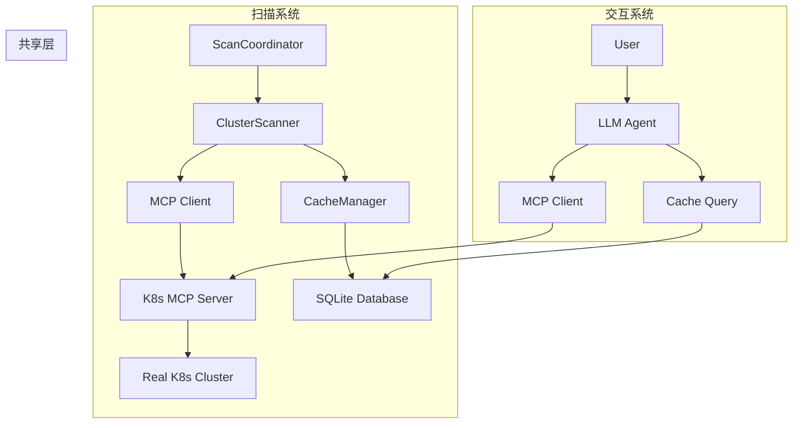

# K8s MCP系统工作原理文档

## 1. 系统架构概述

K8s MCP系统由两个独立但相关的子系统组成：

### 1.1 扫描系统 (Scan System)
- **目的**: 定期扫描K8s集群状态并缓存到SQLite
- **特点**: 独立运行，不依赖LLM Agent
- **组件**: ScanCoordinator, ClusterScanner, CacheManager

### 1.2 交互系统 (Main System) 
- **目的**: 提供智能的K8s集群交互和用户服务
- **特点**: 基于LLM Agent，支持自然语言交互
- **组件**: LLM Agent, MCP Client, 缓存查询

## 2. 工作原理详解

### 2.1 扫描系统工作流程

```
┌─────────────────┐    ┌─────────────────┐    ┌─────────────────┐
│  ScanCoordinator│────│ ClusterScanner  │────│   MCP Client    │
│   (调度扫描)     │    │   (执行扫描)     │    │  (工具调用)      │
└─────────────────┘    └─────────────────┘    └─────────────────┘
         │                       │                       │
         │                       │                       ▼
         │                       │              ┌─────────────────┐
         │                       │              │ K8s MCP Server  │
         │                       │              │   (MCP工具)      │
         │                       │              └─────────────────┘
         │                       │                       │
         │                       │                       ▼
         │                       │              ┌─────────────────┐
         │                       │              │ Real K8s Cluster│
         │                       │              │   (真实集群)     │
         │                       │              └─────────────────┘
         │                       │
         ▼                       ▼
┌─────────────────┐    ┌─────────────────┐
│  CacheManager   │────│ SQLite Database │
│   (缓存管理)     │    │   (数据存储)     │
└─────────────────┘    └─────────────────┘
```

**扫描流程：**
1. ScanCoordinator 定期触发扫描任务
2. ClusterScanner 通过 MCP Client 调用 K8s MCP 工具
3. MCP 工具直接与真实 K8s 集群通信获取数据
4. 扫描结果通过 CacheManager 存储到 SQLite
5. 应用 TTL 策略管理数据生命周期

### 2.2 交互系统工作流程

```
┌─────────────────┐    ┌─────────────────┐    ┌─────────────────┐
│   User Input    │────│   LLM Agent     │────│   MCP Client    │
│   (用户输入)     │    │ (智能决策引擎)   │    │  (工具调用)      │
└─────────────────┘    └─────────────────┘    └─────────────────┘
                                │                       │
                                │                       ▼
                                │              ┌─────────────────┐
                                │              │ K8s MCP Server  │
                                │              │   (MCP工具)      │
                                │              └─────────────────┘
                                │                       │
                                │                       ▼
                                │              ┌─────────────────┐
                                │              │ Real K8s Cluster│
                                │              │   (真实集群)     │
                                │              └─────────────────┘
                                │
                                ▼
                       ┌─────────────────┐
                       │ SQLite Database │
                       │   (缓存查询)     │
                       └─────────────────┘
```

**交互流程：**
1. 用户输入自然语言请求
2. LLM Agent 理解用户意图并制定执行计划
3. Agent 选择合适的 MCP 工具或查询缓存数据
4. 对于实时操作，直接调用 K8s MCP 工具
5. 对于状态查询，优先使用缓存数据
6. 返回格式化的结果给用户

## 3. 关键区别说明

### 3.1 架构差异

| 方面 | 扫描系统 | 交互系统 |
|------|----------|----------|
| **核心组件** | ScanCoordinator | LLM Agent |
| **工作方式** | 定时批量扫描 | 按需实时响应 |
| **数据流向** | K8s → SQLite | K8s ↔ 用户 |
| **智能程度** | 规则驱动 | LLM 驱动 |
| **运行模式** | 后台服务 | 交互式 |

### 3.2 功能职责

**扫描系统职责：**
- 定期收集集群状态信息
- 维护数据缓存的新鲜度
- 执行 TTL 清理和数据去重
- 提供基础数据支撑

**交互系统职责：**
- 理解用户自然语言请求
- 智能选择执行策略
- 执行实时 K8s 操作
- 提供用户友好的响应

## 4. 共享组件

### 4.1 MCP 工具层
```
┌─────────────────────────────────────────────────────────────┐
│                    MCP 工具层 (共享)                         │
├─────────────────────────────────────────────────────────────┤
│ • k8s_get_cluster_info    • k8s_list_pods                   │
│ • k8s_list_namespaces     • k8s_list_services               │
│ • k8s_list_nodes          • k8s_create_deployment           │
│ • k8s_get_pod_logs        • k8s_delete_resource             │
└─────────────────────────────────────────────────────────────┘
         ▲                                    ▲
         │                                    │
┌─────────────────┐                 ┌─────────────────┐
│   扫描系统       │                 │   交互系统       │
│ (直接调用MCP)    │                 │ (通过Agent调用)   │
└─────────────────┘                 └─────────────────┘
```

### 4.2 数据存储层
```
┌─────────────────────────────────────────────────────────────┐
│                SQLite 数据库 (共享)                          │
├─────────────────────────────────────────────────────────────┤
│ • clusters (集群信息)     • pods (Pod状态)                   │
│ • namespaces (命名空间)   • services (服务信息)              │
│ • nodes (节点信息)        • cache_metadata (缓存元数据)      │
└─────────────────────────────────────────────────────────────┘
         ▲                                    ▲
         │                                    │
    ┌─────────┐                         ┌─────────┐
    │ 写入数据 │                         │ 读取数据 │
    │ (扫描)  │                         │ (查询)  │
    └─────────┘                         └─────────┘
```

## 5. 数据流向图

### 5.1 完整数据流


### 5.2 时序关系
```
时间轴：
├── T1: 扫描系统启动，开始定期扫描
├── T2: 首次扫描完成，SQLite 中有基础数据
├── T3: 交互系统启动，可以查询缓存数据
├── T4: 用户请求 → Agent 优先使用缓存
├── T5: 实时操作 → Agent 直接调用 MCP 工具
├── T6: 扫描系统更新缓存数据
└── T7: 循环...
```

## 6. 启动和运行方式

### 6.1 扫描系统启动
```bash
# 方式1: 独立扫描演示
uv run python src/scanner/scanner_demo.py

# 方式2: 集成测试
uv run python test/test_scan_integration.py

# 方式3: 后台服务模式
uv run python script/run-scanner-demo.py
```

### 6.2 交互系统启动
```bash
# 启动主要的 K8s MCP Agent
uv run python src/main.py
```

### 6.3 独立运行验证
```bash
# 验证扫描系统独立性
ps aux | grep scanner  # 只运行扫描系统

# 验证交互系统独立性  
ps aux | grep main     # 只运行交互系统

# 两者可以同时运行，共享数据库
```

## 7. 维护要点

### 7.1 系统独立性
- ✅ 扫描系统可以独立运行和维护
- ✅ 交互系统可以独立运行和维护  
- ✅ 两者通过 SQLite 数据库松耦合
- ✅ MCP 工具层提供统一的 K8s 接口

### 7.2 故障隔离
- 扫描系统故障不影响交互系统的实时操作
- 交互系统故障不影响扫描系统的数据收集
- 数据库故障会影响两个系统，但可以降级到直接 MCP 调用

### 7.3 扩展性
- 可以独立扩展扫描频率和范围
- 可以独立升级 LLM Agent 能力
- 可以添加新的 MCP 工具而不影响现有功能

## 8. 代码组织结构

### 8.1 扫描系统代码
```
src/scanner/
├── scanner_demo.py          # 扫描演示入口
├── scan_coordinator.py      # 扫描协调器
├── cluster_scanner.py       # 集群扫描器
└── resource_parser.py       # 资源解析器

src/cache/
├── cache_manager.py         # 缓存管理器
└── ttl_manager.py          # TTL管理器

src/mcp_tools/
├── tool_loader.py          # MCP工具加载器
└── k8s_tools.py           # K8s工具定义
```

### 8.2 交互系统代码
```
src/
├── main.py                 # 主入口，LLM Agent
├── agent/
│   ├── llm_config.py      # LLM配置
│   └── agent_core.py      # Agent核心逻辑
└── mcp_tools/             # 共享MCP工具
```

### 8.3 共享组件代码
```
src/mcp_tools/             # MCP工具层(共享)
src/cache/                 # 缓存层(共享)
data/k8s_cache.db         # SQLite数据库(共享)
.env                      # 配置文件(共享)
```

## 9. 配置管理

### 9.1 扫描系统配置
```bash
# 扫描相关配置
SCANNER_STATIC_INTERVAL=1800    # 静态资源扫描间隔(30分钟)
SCANNER_DYNAMIC_INTERVAL=300    # 动态资源扫描间隔(5分钟)
SCANNER_TIMEOUT=120             # 扫描超时时间(2分钟)

# 缓存配置
CACHE_STATIC_TTL=1800          # 静态资源TTL(30分钟)
CACHE_DYNAMIC_TTL=300          # 动态资源TTL(5分钟)
CACHE_DB_PATH=./data/k8s_cache.db
```

### 9.2 交互系统配置
```bash
# LLM配置
LLM_PROVIDER=openrouter
LLM_MODEL=google/gemini-2.0-flash-exp
LLM_API_KEY=your_api_key
LLM_MAX_TOKENS=32000
LLM_TIMEOUT=600

# Agent配置
AGENT_MAX_STEPS=10
AGENT_ENABLE_CACHE_QUERY=true
AGENT_FALLBACK_TO_DIRECT_MCP=true
```

### 9.3 MCP工具配置(共享)
```bash
# MCP服务器配置
MCP_SERVER_URL=stdio:///path/to/k8s-mcp
MCP_SERVER_TYPE=stdio
MCP_SERVER_NAME=k8s-mcp
```

## 10. 运行时行为

### 10.1 扫描系统运行时
```python
# 扫描系统的典型运行循环
async def scan_system_main_loop():
    while True:
        try:
            # 1. 检查是否需要扫描静态资源
            if should_scan_static_resources():
                await scan_static_resources()

            # 2. 检查是否需要扫描动态资源
            if should_scan_dynamic_resources():
                await scan_dynamic_resources()

            # 3. 清理过期的缓存数据
            cleanup_expired_cache()

            # 4. 等待下次检查
            await asyncio.sleep(60)  # 每分钟检查一次

        except Exception as e:
            # Fail-fast: 记录错误但继续运行
            logger.error(f"Scan loop error: {e}")
            await asyncio.sleep(60)
```

### 10.2 交互系统运行时
```python
# 交互系统的典型处理流程
async def agent_main_loop():
    while True:
        try:
            # 1. 等待用户输入
            user_input = await get_user_input()

            # 2. LLM Agent分析用户意图
            intent = await agent.analyze_intent(user_input)

            # 3. 选择执行策略
            if intent.requires_real_time_data:
                # 直接调用MCP工具获取最新数据
                result = await call_mcp_tools(intent.tools)
            else:
                # 优先查询缓存数据
                result = await query_cache_data(intent.query)

            # 4. 格式化并返回结果
            response = await agent.format_response(result)
            await send_response(response)

        except Exception as e:
            # Fail-fast: 向用户报告错误
            await send_error_response(f"处理请求时出错: {e}")
```

## 11. 性能和资源使用

### 11.1 扫描系统资源使用
- **CPU**: 低，主要在扫描期间有峰值
- **内存**: 中等，需要缓存扫描结果
- **网络**: 中等，定期与K8s API通信
- **存储**: 低，主要是SQLite数据库增长

### 11.2 交互系统资源使用
- **CPU**: 中等，LLM推理需要计算资源
- **内存**: 高，LLM模型和上下文管理
- **网络**: 高，LLM API调用和K8s操作
- **存储**: 低，主要是日志和临时数据

### 11.3 资源优化建议
```bash
# 扫描系统优化
SCANNER_BATCH_SIZE=100          # 批量处理大小
SCANNER_CONCURRENT_LIMIT=3      # 并发扫描限制
CACHE_CLEANUP_INTERVAL=300      # 缓存清理间隔

# 交互系统优化
AGENT_CONTEXT_WINDOW=100000     # 上下文窗口大小
AGENT_CACHE_QUERY_TIMEOUT=5     # 缓存查询超时
AGENT_MCP_CALL_TIMEOUT=30       # MCP调用超时
```

---

**总结：您的理解基本正确，但关键澄清是：**
1. ✅ scan 和 main 之间没有直接通信
2. ✅ 它们共享 MCP 工具和 SQLite 数据库
3. ❌ scan 不是"初始化 agent"，而是独立的扫描系统
4. ❌ main 中的 agent 和 scan 是不同的架构组件
5. ✅ 两者都可以调用相同的 K8s MCP 工具

**这个文档已保存到 `script/system-architecture-working-principles.md`，方便团队维护和理解系统架构。**
